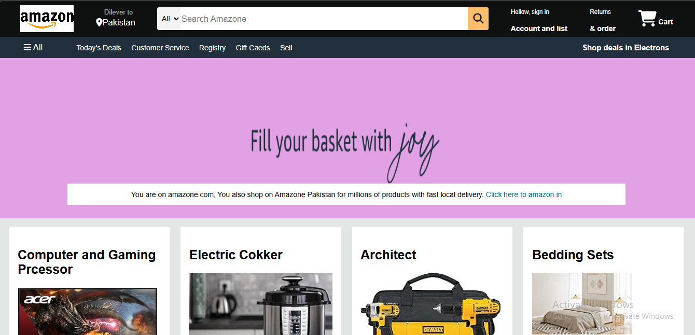
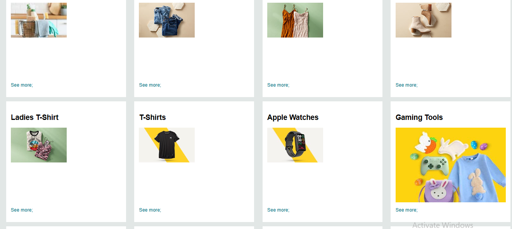
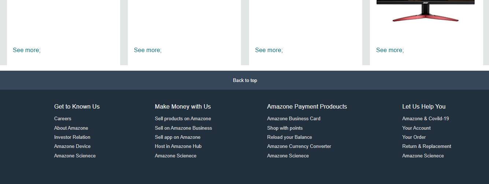
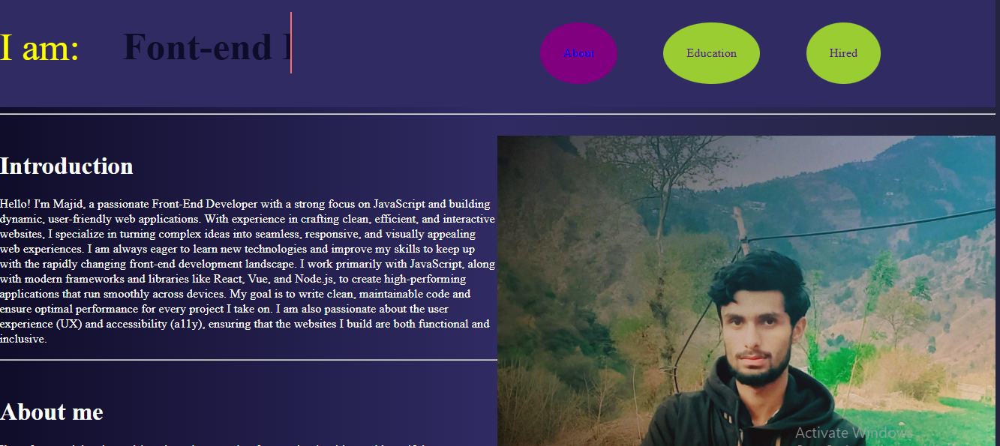
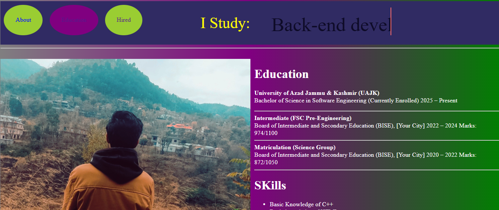

# 🌐 Majid's Frontend Projects

This repository contains beginner-level frontend projects demonstrating my skills in HTML, CSS, and responsive UI design. Scroll down to explore each project with screenshots and feature details.

---
============================================
 
 

# 🛒 1️⃣ Amazon Clone Project

A beginner-level Amazon Clone homepage replicating the basic layout and design of the popular e-commerce website using pure HTML and CSS.

---

## 💡 Features:

✔ Header with logo, search bar, and cart icon  
✔ Product sections styled to mimic real e-commerce layout  
✔ Fully responsive for desktop and mobile  
✔ Hoverable buttons and product effects  

---
==================================================
 
 

## 📸 Screenshots:

**Homepage View**  

---
=====================================
 
 

**Product Section View**  

---
=====================================
 
 

**Footer View**  

---
=====================================
 
 

## 🛠 Technologies Used:

- HTML5  
- CSS3  

---
=====================================
 
 

## 🚀 How to Run:

Open `Amazone.html` in your browser to view the Amazon Clone layout.

---
======================================
 
 
 
 

# 🎨 2️⃣ Personal Portfolio Website

A clean, responsive personal portfolio to showcase my details, education, and GitHub profile with interactive elements.

---

## 💡 Features:

✔ Navbar with About, Education, and Hire Me sections (hoverable)  
✔ GitHub Profile button with hover effect  
✔ Clean responsive layout for all devices  

---
=========================================
 
 

## 📸 Screenshots:

**About Section**  

---
===========================================
 
 

**Education Section**  

---
==============================================
 
 

**Contact / Hire Me Section**  

---
================================================
 
 

## 🛠 Technologies Used:

- HTML5  
- CSS3  

---

## 🚀 How to Run:

Open `Portofolio.html` in your browser to explore the Portfolio website.

---

# 📬 Contact:

✔ [My GitHub Profile](https://github.com/your-username)  
✔ Open for collaboration and feedback  
